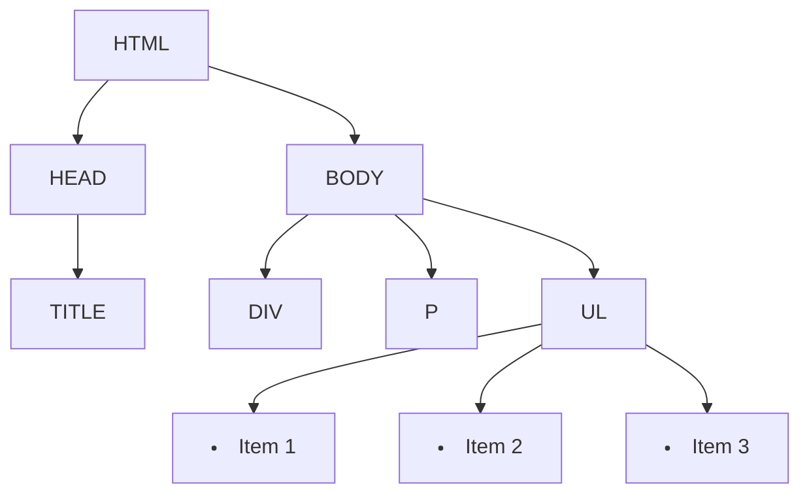
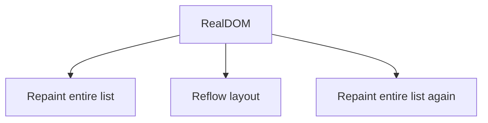

# Virtual DOM
Before diving into the Virtual DOM, let's get a grip on what the [DOM](Terminology.md#dom) is. The DOM is a programming interface that represents the structure of a web page. Think of it as a tree where each node is an element (like `
`, `
`, etc.) on the page. Here’s a simple Mermaid diagram to visualize it:

## 🧙‍♂️ What is the virtual DOM?
The **Virtual DOM** is like a magical, lightweight copy of the real DOM. It’s a representation in memory that helps libraries like React manage changes efficiently. Instead of directly manipulating the actual DOM (which can be slow), React manipulates the Virtual DOM first, figures out the minimal changes required, and then updates the real DOM.
## 🐢 Why not just use the real DOM?
The real DOM is slow, especially when you're making frequent updates. Each time the DOM changes, the browser has to reflow the layout and repaint the UI. This can cause janky, unresponsive user interfaces.

Imagine updating a list of items every time a new one is added:

## 🚀 Virtual DOM to the rescue
With the Virtual DOM, you don’t have to worry about these performance hits. When something changes:

1. **React updates the Virtual DOM**: Instead of touching the real DOM, React updates the Virtual DOM.
2. **Diffing**: React compares the new Virtual DOM with the previous version to find out what’s changed.
3. **Efficient updates**: Only the parts of the real DOM that need to be updated are changed.

## 🧠 Advanced Understanding: The Reconciliation Process
**Reconciliation** is the process where React compares the old and new Virtual DOM trees. It uses a set of efficient heuristics to determine the best way to update the UI. This is where key concepts like **keys** in lists become crucial. When React sees a key, it uses it to track items between updates, ensuring minimal updates to the DOM.

## 🧐 Common Misconceptions
If your application involves frequent updates, especially in large lists or complex UI components, the Virtual DOM can be a game-changer. However, if you're building a static page or one with minimal interactivity, it might be overkill.

## 🎁 Wrapping up
The Virtual DOM is a powerful concept that allows React to deliver fast, responsive UIs. It abstracts the complexity of DOM manipulation, making it easier for developers to focus on building features rather than optimizing performance.